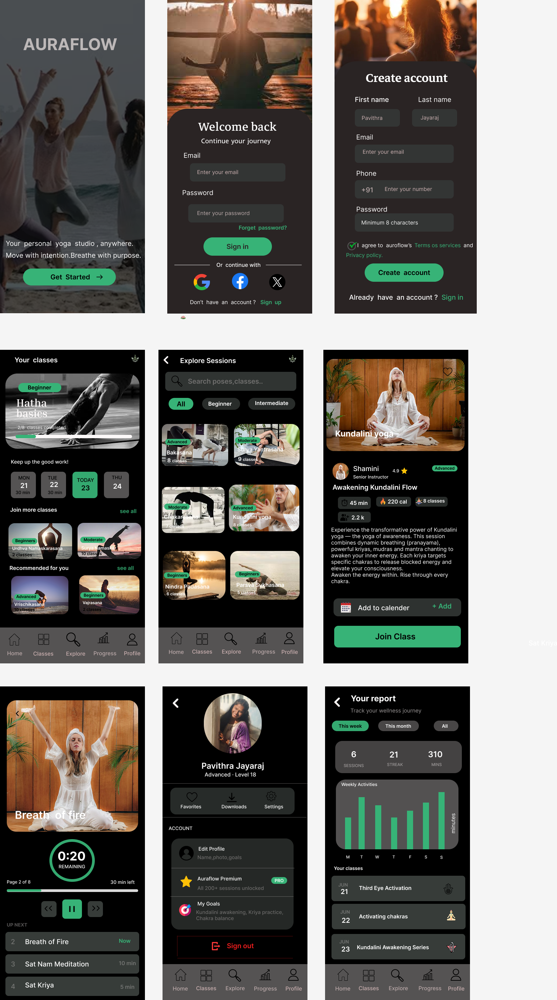
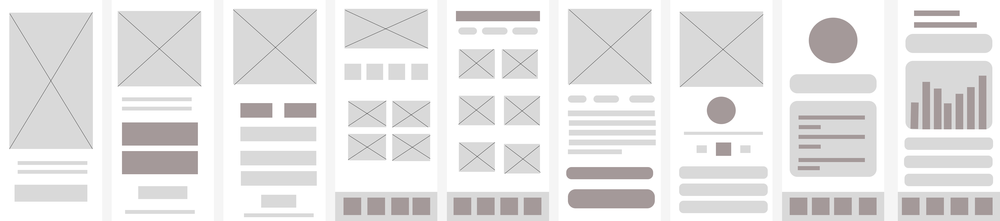

# codealpha_UIUXInternship
UI/UX Internship tasks completed for CodeAlpha (Wireframe, UI Design, Prototype, UX Case Study)
# CodeAlpha UI/UX Internship

## 👩‍💻 Name: Pavithra J  
## 🎯 Domain: UI/UX Design  
## 📅 Duration: 01 May 2026 – 30 May 2026  

---

## 🎯 Objective
The objective of this internship is to gain practical knowledge in UI/UX design by working on real-world design tasks including wireframing, UI design, prototyping, and UX case study analysis.

---

## 📌 Tasks Completed

### Task 1: Wireframing
Created low-fidelity wireframes for a mobile application using Figma. This helped in understanding layout structure and user flow.

### Task 2: High-Fidelity UI Design
Converted wireframes into visually appealing UI designs with proper color schemes, typography, icons, and components using Figma.

### Task 3: UX Case Study
Performed a detailed UX case study on a real-world application, analyzing user journey, strengths, weaknesses, and suggested improvements.

### Task 4: Prototype Design
Developed a clickable prototype using Figma to simulate real user interaction and improve usability understanding.

---

## 🔗 Important Links
-  WireFrameLink:https://www.figma.com/design/ZdRS91zPO4lPXIEeQHjfv6/auraflow?node-id=0-1&p=f&t=V9pEJVXCXUzjwPKN-0
-  Figma Prototype: https://www.figma.com/proto/ZdRS91zPO4lPXIEeQHjfv6/aurafloww?node-id=12-66&p=f&t=HQ5Atq58fVQa8uoC-1&scaling=scale-down&content-scaling=fixed&page-id=0%3A1&starting-point-node-id=1%3A3  
-  UX Case Study: Task3_UX_Case_Study.pdf  

---

## 🛠 Tools Used
- Figma  
- Google Docs  
- UX Research Methods  

---

## 📈 Learning Outcome
- Understanding of UI/UX design principles  
- Experience in wireframing and prototyping  
- Improved design thinking and problem-solving skills  
- Hands-on experience with Figma  

---
# Task 1: Wireframing – UI Design

## 📌 Project Overview
This task involves creating low-fidelity wireframes for a mobile application using Figma.  
The wireframes represent the basic structure and user flow of the app before applying visual design.

---

### High Fedility Wireframe

### Low Fedility Wireframe

## 📁 Files Included
- Full wireframe set (AuraFlow design)
- Low-fidelity UI screens
- User flow design

---

## 🎯 Objective
To understand user flow, layout structure, and interaction design before moving into high-fidelity UI design.

## 🙏 Acknowledgement
I would like to thank CodeAlpha for providing this opportunity to learn and work on real-world UI/UX design tasks.
